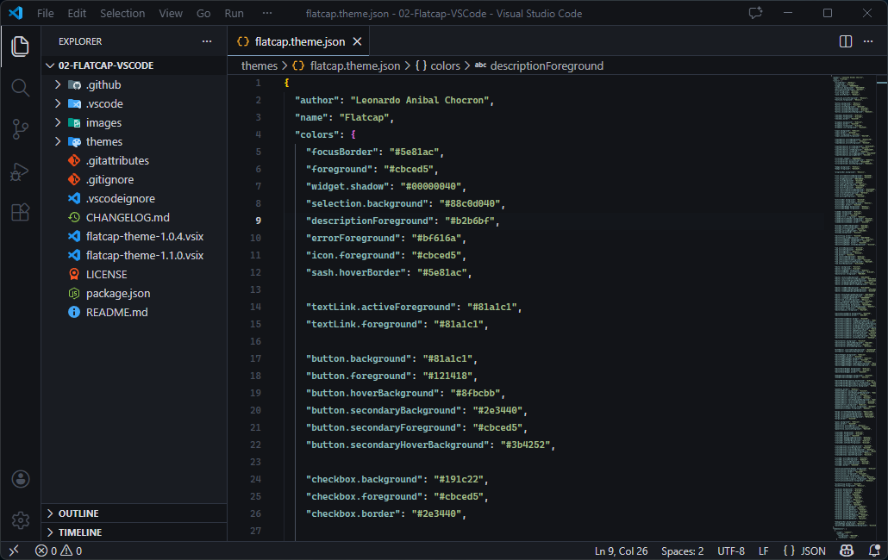

# [Flatcap](https://github.com/cheycron/flatcap-theme) for Visual Studio Code

  [](https://marketplace.visualstudio.com/items?itemName=cheycron.flatcap-theme)

**[Flatcap](https://github.com/cheycron/flatcap-theme)** is a design system and color scheme tailored for application interfaces, code editors, and data-dense dashboards. Available on the **[VS Code Marketplace](https://marketplace.visualstudio.com/items?itemName=cheycron.flatcap-theme)**.

<p align="center">
  
</p>

## 🚀 How to Install

1.  Open **Visual Studio Code**.
2.  Go to the **Extensions** view (`Ctrl+Shift+X`).
3.  Search for `Flatcap`.
4.  Click **Install**.
5.  Click **Set Color Theme** and select **Flatcap**.

---

## 🎨 Philosophy & Design

**[Flatcap](https://github.com/cheycron/flatcap-theme)** draws inspiration from the *Nord theme*, embracing principles of calm, clean aesthetics, and a dimmed pastel color approach. It is built to be:

- **Minimalist:** Reduces visual noise by avoiding harsh contrasts.
- **Comfortable:** Specifically tuned for low-light environments to reduce eye strain.
- **Modern:** Uses a flat, matte color finish that feels distinct yet familiar.

### Color Palette

The system relies on **20 core colors** divided into four distinct families.

| Family | Description |
| :--- | :--- |
| **Deep Twilight** | Structural foundation. Deep, matte backgrounds (`#121418`) to create focus. |
| **Dawnlight** | Typography hierarchy. From muted metadata (`#b2b6bf`) to crisp body text (`#cbced5`). |
| **Ocean Blues** | Primary interaction. Calming blues (`#81a1c1`) for actions and navigation. |
| **Vivid Accents** | Semantic feedback. Desaturated accents for errors (`#bf616a`) and success (`#a3be8c`). |

## ✒️ Typography & Fonts

For the best visual experience, **[Flatcap](https://github.com/cheycron/flatcap-theme)** recommends configuring your editor settings with these fonts:

*   **[Cascadia Code NF](https://github.com/microsoft/cascadia-code/releases)** (Recommended)
*   *Fallbacks:* `Fira Code`, `JetBrains Mono`.

### Recommended Settings

Add this to your `settings.json` for the full experience:

```json
{
  "editor.fontFamily": "'Cascadia Code NF', 'Fira Code', monospace",
  "editor.fontLigatures": true,
  "editor.fontSize": 14,
  "workbench.colorTheme": "Flatcap"
}
```

---

<p align="center">
  Distributed under the MIT License.
</p>

<p align="center">
  <a href="https://www.buymeacoffee.com/cheycron">
    
  </a>
</p>